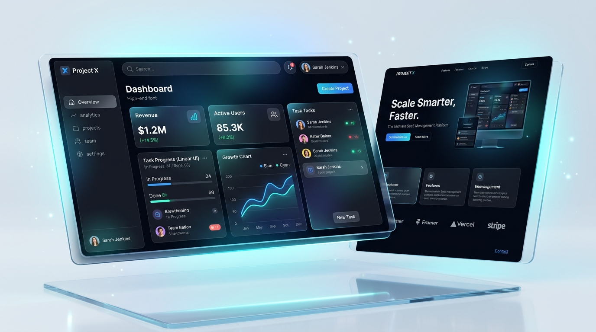

# 🚀 ALIGN STUDIO — Fullstack Web Application (React TSX + Node.js)

Bienvenido al repositorio oficial de **ALIGN STUDIO**, una plataforma web de alto impacto visual y rendimiento superior diseñada para agencias y empresas que buscan destacar en el entorno digital.



---

## 🛠️ Tecnologías & Arquitectura

El proyecto ha sido transformado desde una estructura estática a una aplicación **Fullstack moderna con Next.js 14 (App Router)**, totalmente tipada en **TypeScript** y preparada para despliegue serverless continuo en **Vercel**.

* **Frontend**: React 18, TSX, Next.js 14 App Router, Lucide React.
* **Backend**: Node.js (API Routes Serverless en `/app/api/contact/route.ts`).
* **Estilos & UI**: Sistema de diseño Vanilla CSS puro con variables CSS3, Glassmorphism, animaciones suaves y paleta cromática tailoreada (*Azul Real `#1D4ED8` & Cobalto `#2563EB`*).
* **SEO & Semántica**: Next.js Metadata API, Open Graph, Twitter Cards, Marcado JSON-LD **Schema.org** (`ProfessionalService`) y jerarquía de títulos optimizada.
* **Deploy**: Vercel Ready (`vercel.json`).

---

## ✨ Características Principales

* **Navbar Glassmorphic**: Detección dinámica de scroll con desenfoque de fondo y diseño ultra limpio.
* **Hero de Alto Impacto**: Encabezado optimizado para intencionalidad de búsqueda comercial, insignias animadas y botones interactivos.
* **Bento Grid (Sobre Nosotros)**: Exhibición de capacidades técnicas (*Diseño Estratégico, Desarrollo Web, UI/UX, Branding, Automatización e IA*).
* **Grid de Servicios**: Tarjetas interactivas con solicitud directa preseleccionada en el formulario.
* **Portafolio Interactivo con Filtros**: Filtrado dinámico sin recargar la página (*Todos, Desarrollo Web, Diseño Web & E-Commerce, IA & Automatización, Branding*) y vista en modal detallada.
* **Metodología // Carrusel de Procesos 🐱**: Carrusel paso a paso (*Descubrimiento, Estrategia, Diseño, Desarrollo*) con reproducción automática y controles manuales.
* **Modal de Contacto Asíncrono**: Conectado directamente a la API Route de Node.js (`POST /api/contact`) con feedback mediante notificaciones Toast.

---

## 📁 Estructura del Proyecto

```text
├── app/
│   ├── api/
│   │   └── contact/
│   │       └── route.ts       # Backend Node.js API Route para formulario
│   ├── globals.css            # Sistema de diseño CSS global
│   ├── layout.tsx             # Root layout con Google Fonts & SEO Metadata
│   └── page.tsx               # Página principal (Home)
├── components/                # Componentes React TSX Modulares
│   ├── Navbar.tsx
│   ├── Hero.tsx
│   ├── AboutBento.tsx
│   ├── ServicesGrid.tsx
│   ├── PortfolioGrid.tsx
│   ├── CatCarousel.tsx
│   ├── CtaSection.tsx
│   ├── Footer.tsx
│   ├── ContactModal.tsx
│   ├── ProjectModal.tsx
│   └── Toast.tsx
├── public/
│   └── assets/                # Imágenes y activos estáticos
├── types/
│   └── index.ts               # Interfaces TypeScript
├── next.config.mjs
├── package.json
├── tsconfig.json
└── vercel.json
```

---

## ⚡ Instalación y Ejecución Local

1. **Clonar el repositorio**:
   ```bash
   git clone https://github.com/alignstudioweb/portafolio.git
   cd portafolio
   ```

2. **Instalar dependencias**:
   ```bash
   npm install
   ```

3. **Iniciar el servidor de desarrollo**:
   ```bash
   npm run dev
   ```
   Abre [http://localhost:3000](http://localhost:3000) en tu navegador.

4. **Compilar para producción**:
   ```bash
   npm run build
   ```

---

## ☁️ Despliegue en Vercel

1. Sube tu código a GitHub.
2. Inicia sesión en [Vercel](https://vercel.com/) e importa el repositorio.
3. Vercel detectará la configuración de **Next.js** y compilará la aplicación de manera automática.

---

## 📄 Licencia

&copy; 2026 **ALIGN STUDIO**. Todos los derechos reservados.
